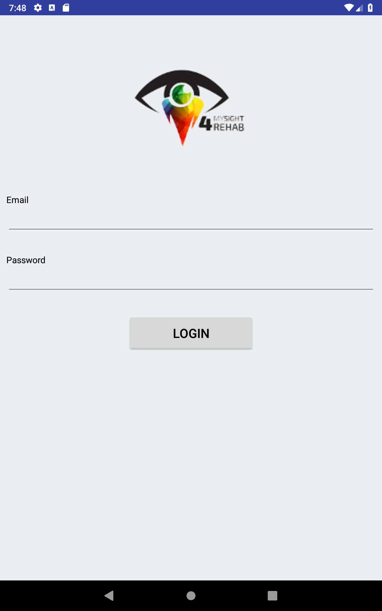
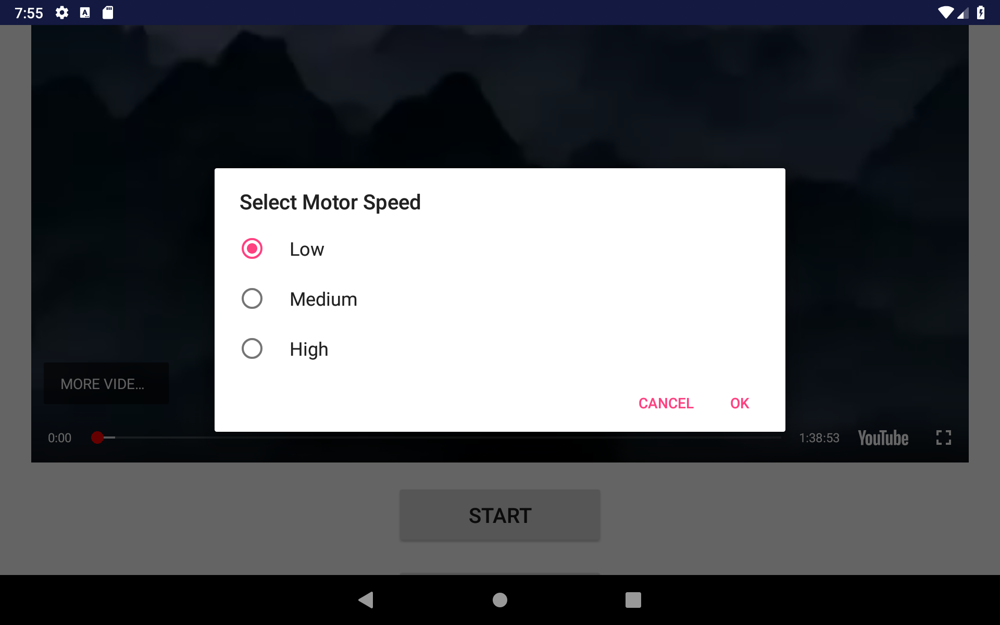

# Hand Cycle App

  

  

  

  

## Getting Started

This is a mobile app developed for IEEE MySIGHT4Rehab project name "[Development of low cost upper and lower extremities rehabilitation system with interactive feedback for children with movement disorders](https://ieeexplore.ieee.org/document/7843556/)", which capable of communicating with [Firebase](https://firebase.google.com/) host and [Arduino](https://www.arduino.cc/) board via Bluetooth communication. This project is developed altogether with a [website](https://github.com/ieeemysight4rehab/hand-cycle-web).

## Deployment

Tested on Android tablet.

## Built With

* [Android Studio](https://developer.android.com/studio/)

## Versioning

[Semantic Versioning (SemVer) 2.0.0](http://semver.org/)

## Authors

**Jerry Chong** - [jerrychong25](https://github.com/jerrychong25)

## License

This project is licensed under the MIT License - see the [LICENSE.md](LICENSE.md) file for details.
